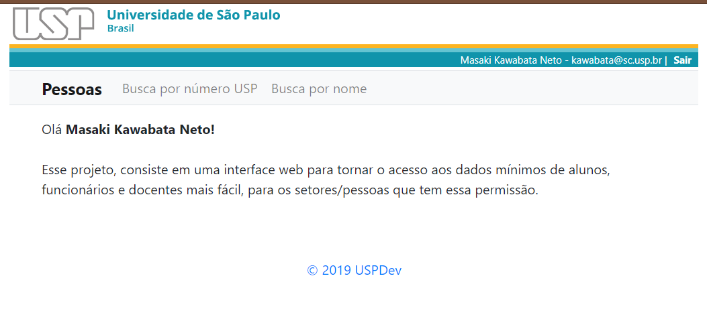

# Motivação

Nas unidades, muitos setores precisam acessar os dados mínimos de alunos, funcionários e docentes,
esses dados são replicados e as consultas estão abstraídas no projeto [replicado](https://github.com/uspdev/replicado). 

Esse projeto, consiste em uma interface web para tornar o acesso a esses dados mais fácil, para os setores/pessoas que tem essa permissão.

## Requisitos

* Um banco de dados local 
* Um token do oauth
* Acesso ao replicado

## Deploy

Clonar o projeto

    git clone git@github.com:uspdev/pessoas.git

Instalar as dependências do composer

    composer install
    
Copiar o .env.example para .env e editar o necessário\
OBS1. na url do oauth_consumidor deve finalizar com "/callback"\
OBS2. deve-se autorizar o usuário em "SENHAUNICA_ADMINS"

Rodar o migration

    php artisan:migrate

Gerar a chave do laravel

    php artisan key:generate

Publicar os assets

    php artisan vendor:publish --provider="Uspdev\UspTheme\ServiceProvider" --tag=assets --force

Você pode rodar em testes usando o servidor embitido

    php artisan serve

Ou publicar em produção utilizando seu servidor favorito (ex. Apache)